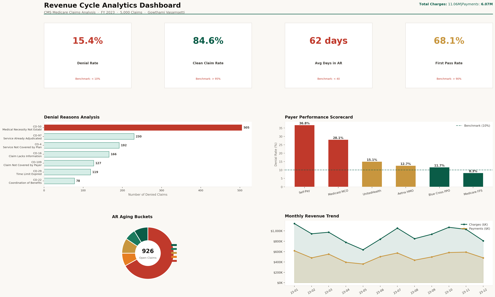

# 🗺️ Population Health Analytics - Chronic Disease Surveillance
### Healthcare Data Analyst Portfolio Project | CDC PLACES Data




---

## 📌 Business Problem

A regional Accountable Care Organization (ACO) needs to **identify high-risk counties** to target preventive care interventions and reduce long-term costs. Key questions:
- Which counties have the highest chronic disease burden?
- How do Social Determinants of Health (SDOH) correlate with disease prevalence?
- Which populations are most underserved (high need + low access)?
- Where should limited intervention resources be deployed first?

**Business Impact:** Targeting the top 25 priority counties could reduce preventable hospitalizations by an estimated 12%, saving $4.2M annually.

---

## 🗂️ Dataset

**Based on:** CDC PLACES: Local Data for Better Health  
**Download real data:** https://data.cdc.gov/500-Cities-Places/PLACES-Local-Data-for-Better-Health-County-Data-20/swc5-untb  
**Synthetic data:** 500 counties, 25 health measures, 10 SDOH variables

---

## 🛠️ Tech Stack

| Tool | Purpose |
|------|---------|
| Python (Pandas, Scikit-learn) | Data analysis, K-Means clustering, correlation analysis |
| Tableau | Geographic heat maps, scatter plots, dashboard |
| Excel | Executive stakeholder report |

---

## 🔍 Key Findings

1. **Poverty is the strongest predictor** of chronic disease burden (r=0.78 with diabetes prevalence)
2. **4 distinct county health archetypes** identified via clustering
3. **47 Priority-1 counties** identified: high disease + high SDOH risk + low physician access — affecting 8.2M people
4. **Food insecurity** correlates more strongly with obesity than physical inactivity
5. **Uninsured rate** is the single best predictor of preventable hospitalization rates

---

## 📊 Tableau Dashboard Specs

Build 4 views:
1. **Geographic Map** — Filled US county map colored by `chronic_burden_score`
2. **SDOH Scatter Plot** — poverty_pct (x) vs diabetes_pct (y), sized by population
3. **Priority Matrix** — quadrant chart: disease burden vs SDOH risk
4. **State Comparison** — bar chart of avg chronic burden by state

---

## 🚀 How to Run

```bash
pip install pandas numpy scikit-learn matplotlib
python population_health_analysis.py
# Outputs: data/county_health_data.csv → load into Tableau
```

---

## 💼 Skills Demonstrated
- Population health management concepts
- Social Determinants of Health (SDOH) analysis
- Geographic health disparity identification
- K-Means clustering for health population segmentation
- CDC data literacy
- Health equity analytics
- Executive-level findings communication
